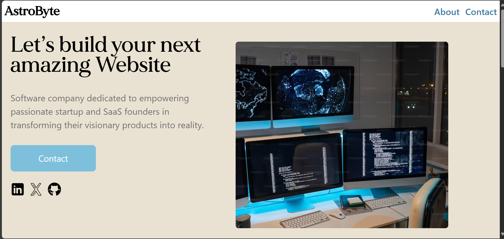

# 🚀AstroByte Technologies

## Live Demo

### 

## Design Choices

- The design of the AstroByte website emphasizes a clean, modern layout that enhances user experience and accessibility. I chose a responsive design to ensure optimal viewing on various devices, utilizing a flexible grid system. The color palette features #3B7A9D as the primary blue, symbolizing trust and professionalism, complemented by #E9E2D2 for backgrounds, creating a calming contrast. This combination reflects our commitment to innovation and reliability in software development.

## JavaScript Features

- To enhance interactivity, I implemented several JavaScript features, including form validation for user inputs on contact forms, ensuring data integrity before submission. Additionally, I added dynamic elements such as loading spinners during form submissions and success alerts that provide immediate feedback to users.

## Challenges Faced

- A key challenge in developing the AstroByte website was ensuring responsiveness across various devices, including smartphones, tablets, and desktops. To tackle this, I employed CSS Flexbox and Grid systems, allowing for flexible layouts that adapt seamlessly to different screen sizes. Tailwindcss media queries were utilized to fine-tune styles for specific breakpoints, ensuring optimal readability and usability.

## Deployment Process

- For deployment, I used Git for version control and hosted the website on a cloud platform railway.
